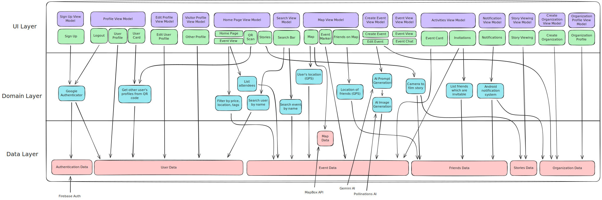

<h1 align="center">StudentConnect</h1>
<p align="center"><strong>Switzerland’s student life hub</strong></p>
<p align="center"><sup>Kotlin · Jetpack Compose · Firebase · Mapbox · AI</sup></p>

📱 Mobile app built by students, for students in Switzerland to connect through events, interests, and campus associations.

## Overview
StudentConnect centralizes student life: discover and host events, join associations, chat with peers, and navigate campus activities from one place. The app is built with Jetpack Compose and Firebase, with maps, chat, AI-generated banners, and QR-powered networking baked in.

## Feature Highlights

- Authentication & onboarding: Google sign-in, dedicated flows for students and organizations, rich profiles with interests, photos, social links, and shareable profile QR codes.
- Event discovery & hosting: Home feed and search, public or private events with templates, invite friends, polls for coordination, countdowns, and AI banner generation (Gemini with graceful fallback).
- Maps & calendar: Mapbox-based map with event and friend markers, search, optional location sharing, calendar of joined events, and reminders for upcoming activities.
- Communication & engagement: Event chat with typing indicators, push notifications via FCM, background reminders with WorkManager, stories/camera surfaces, and QR scanning that opens profiles instantly.
- Associations tooling: Organization signup, team roles, managed organization profiles, and event statistics dashboards for organizers.

## Tech Stack

- Kotlin and Jetpack Compose (Material3, Navigation) with MVVM.
- Firebase: Auth, Firestore, Storage, Realtime Database, Cloud Messaging.
- Maps: Mapbox Compose SDK plus Google Maps Compose utilities.
- Media & QR: CameraX, ML Kit barcode scanning, Coil image loading, QR generation.
- AI: Gemini + Pollinations pipeline for event banners (configurable via `GEMINI_API_KEY`).
- Tests: JUnit/Robolectric unit tests, Espresso/Kaspresso UI tests, MockK/Mockito.

## Architecture

MVVM with a repository layer (`model/`), Compose UI in `ui/`, and background workers/notifications in `service/`.



## Wiki

See the [Project wiki](https://github.com/StudentConnect-SwEnt/StudentConnect/wiki).

## Design

See the design on [Figma](https://www.figma.com/design/o08ZOLr2SxUiip650CyqbW/App?m=auto&t=pcxsobh043Boudab-1).

## Getting Started

### Prerequisites
- Android Studio compatible with AGP 8.6 / Kotlin 2.2, Android SDK 35, and an emulator or device on API 29+.
- JDK 17 configured for Gradle.

### 1) Clone and set up Git hooks

```sh
git clone https://github.com/StudentConnect-SwEnt/StudentConnect.git
cd StudentConnect
./scripts/setup-hooks.sh
```

### 2) Firebase configuration

- Ensure `app/google-services.json` is present for the `com.github.se.studentconnect` Firebase app.
- Refresh SHA-1 fingerprints when needed:
  ```sh
  ./scripts/get-sha1.sh
  ```
  Add the printed SHA-1 in Firebase console and download an updated `google-services.json`.
- To target a local Firebase emulator suite in debug builds:
  ```sh
  ./gradlew :app:assembleNormalDebug -PuseFirebaseEmulator=true
  ```
  (Debug builds automatically swap Firebase endpoints when this flag is set.)

### 3) Gemini API key for AI banners

- Add `GEMINI_API_KEY=your_key` to `local.properties` or export it in the shell before building. The app falls back to generated gradients if no key is provided.

### 4) Run the app

- Android Studio: select the `normalDebug` variant and press Run.
- CLI:
  ```sh
  ./gradlew :app:assembleNormalDebug
  ./gradlew :app:installNormalDebug
  ```

## Development Workflow

- **Formatting:** `./gradlew ktfmtCheck` (pre-commit hook runs it automatically). Use `./gradlew ktfmtFormat` to fix formatting.
- **Unit tests:** `./gradlew testNormalDebugUnitTest`
- **Instrumented UI tests:** `./gradlew connectedNormalDebugAndroidTest`
- **Lint:** `./gradlew lintNormalDebug`
- **Coverage:** `./gradlew jacocoTestReport` (optionally set `-PcoverageFlavor=resOverride`).

## Team

| Name |
| --- |
| Ali El Azdi |
| Othmane Housni |
| Amir Bouchaoui |
| Habib Aissa |
| Hamza Zoubayri |
| Rita Naimi |
| Tristan Bourquin |

---

<p align="center"><strong>StudentConnect · SWENT Project</strong></p>
